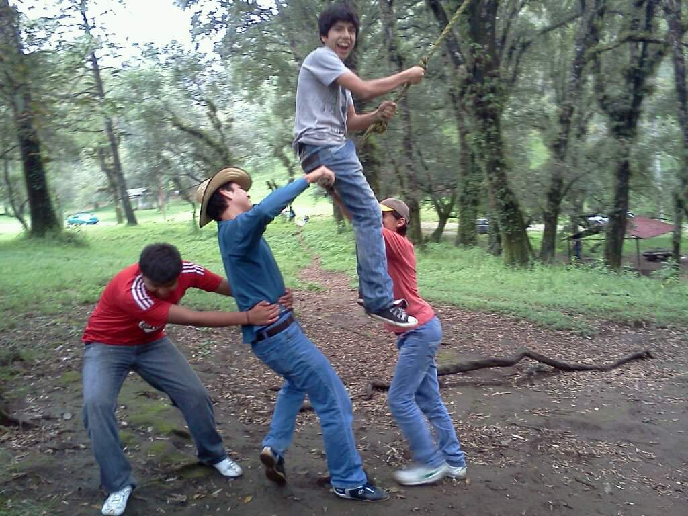
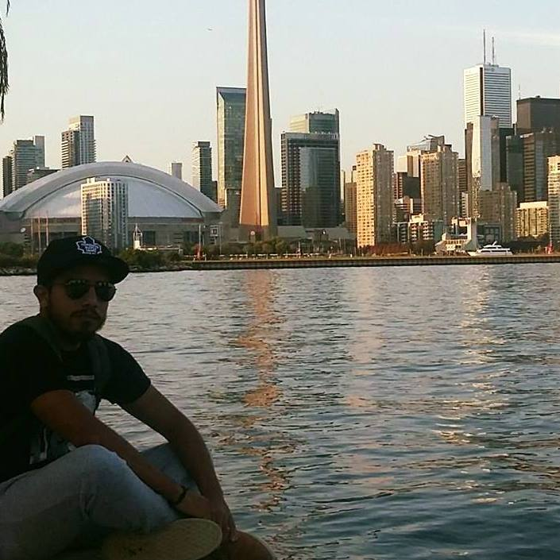

## In Case I Die: Gratitude for the People and Places that Made My Life

These are just a couple of words I want to share in case I die of a sudden death. I am healthy and would love to keep enjoying life for more years. However, accidents happen, and the last adventure could be around the corner.
 
This is addressed to the important people in my life, as well as anyone who cares about me.

## A bit about my life

I am a student from Cdmx in México, I am currently studying Computing Engineering at UNAM. I am from Cuernavaca. I appreciate a lot my routine and I enjoy every day and try to live my life at its fullest.

Life is unpredictable. We never know what tomorrow may bring. But if I were to leave this world, I want to express my gratitude to the people and places that have made my life worth living.

## The people important for me

I had a pretty happy childhood, despite the bad experiences I think about it as a roller coaster.

First and foremost, I want to thank my friends. Among them, Ethan has been my confidante and partner in crime. His humor and empathy have gotten me through some of the toughest times. I am grateful for his presence in my life.

But I also want to express my appreciation to my family. My mother Miriam, my dad David, my grandma, and my aunt, both with the same name MariaLuisa, have been the pillars of my existence. Their love and support have sustained me through thick and thin. I cannot imagine my life without them.

My grandma, in particular, has been a constant source of inspiration. Her strength and resilience in the face of adversity have taught me valuable life lessons. Her love for travel and exploration has ignited my own wanderlust.

## My way to experience the world

Which brings me to the next thing I am grateful for - the ability to travel. I have been fortunate enough to visit some incredible places in my lifetime, but two of my favorites are New York City and Toronto, Canada. Both cities have a special place in my heart.

New York City is a melting pot of cultures, ideas, and experiences. I love the energy and buzz of the city that never sleeps. From the bright lights of Times Square to the serene beauty of Central Park, there is always something to see and do. I am grateful for the memories I have made there.

Toronto, on the other hand, is a more laid-back city, but with its own unique charm. The diversity of the city is reflected in its food, music, and art. I have fond memories of exploring the vibrant neighborhoods and trying new cuisines. I am grateful for the kindness and hospitality of the people I met there.

But my love for travel doesn't end there. There are still so many places I want to visit - from the beaches of Bali to the ancient ruins of Machu Picchu. I am grateful for the world's beauty and diversity, and I hope to experience more of it in the future.

In conclusion, if I were to die tomorrow, I would want to express my gratitude to the people and places that have made my life worth living. To my friends and family, thank you for your love and support. To New York City and Toronto, thank you for the memories. And to the world, thank you for the endless possibilities and adventures. I hope to explore more of it, but even if I don't, I am grateful for what I have already experienced.

The pictures in the article are just some of the sunsets from last year. The cover one is the "Cala Cantalar", probably my favorite spot in my hometown. I enjoyed wonderful moments with wonderful people there.
