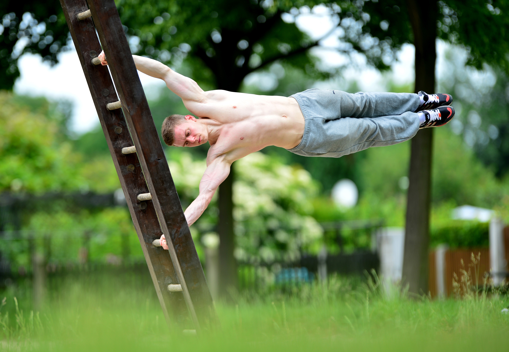

## Table of Contents

- [Introduction](#Introduction)
- [Music](#Music)
- [Calisthenics](#Calisthenics)
- [Programming](#Programming)
- [Eating](#Traveling)
- [Traveling](#Traveling)
- [Conclusions](#Conclusions)

## Introduction

> “There is only one way to eat an elephant: a bite at a time.” - Desmond Tutu

Hobbies are an essential part of my life. They allow me to unwind, relax and pursue my passions. Among my favorite hobbies are music, singing and playing the piano, calisthenics, programming, eating, and traveling. Each of these hobbies has its unique benefits, which I find incredibly fulfilling.

## Music

Music has always been a part of my life. From a young age, I was drawn to the sounds and melodies of various genres, from classical to pop. I started learning the piano when I was nine years old, and it quickly became a significant part of my daily routine. Playing the piano allows me to express myself creatively and to immerse myself in the music. I also enjoy singing, and I find that it complements my piano playing well. Singing helps me develop my vocal skills and improves my musical ear.

## Calisthenics

In addition to music, I also enjoy calisthenics. Calisthenics is a form of exercise that involves bodyweight movements such as push-ups, pull-ups, and squats. I find calisthenics to be an incredibly satisfying form of exercise because it challenges me both mentally and physically. Calisthenics also helps me build strength, flexibility, and endurance, which are essential for maintaining good health and well-being.

## Programming

Another hobby that I enjoy is programming. I find programming to be an incredibly rewarding activity because it allows me to create something from scratch. When I'm programming, I'm fully immersed in the process, and I find it to be a great way to exercise my logical and analytical skills. I also enjoy the satisfaction of seeing my code come to life and being able to share it with others.

## Eating

Eating is another hobby that I find incredibly fulfilling. I enjoy trying new foods and experimenting with different recipes. Cooking allows me to be creative in the kitchen and to explore different flavors and cuisines. I find that eating well is essential for maintaining good health, and I try to make sure that I'm eating a balanced and nutritious diet.

## Traveling

Lastly, traveling is a hobby that I find incredibly enriching. I love exploring new places and immersing myself in different cultures. Traveling allows me to broaden my horizons and gain new perspectives on the world. I also enjoy the sense of adventure that comes with traveling, and I find that it helps me to break out of my comfort zone.

## Conclusions

In conclusion, hobbies are an essential part of my life, and I find them to be incredibly fulfilling. Music, singing and playing the piano, calisthenics, programming, eating, and traveling each provide unique benefits that contribute to my overall well-being. Whether I'm playing the piano, programming, cooking, or traveling, I'm fully engaged in the activity and find it to be a great way to relax and unwind.

